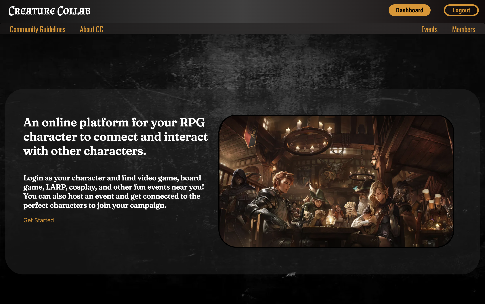

# Creature_Collab

## [Website](https://the-creature-collab.herokuapp.com/)
## [Trello](https://trello.com/b/rbM4aKWL/project-3) 

## Contributers
* Charlie Lin | [in](https://www.linkedin.com/in/charlie-lin1988/)
* Benjamen Peck | [in](https://www.linkedin.com/in/benjaminlpeck/)
* Randall Rouse | [in](https://www.linkedin.com/in/randall-rouse/)
* Katie Vermazani | [in](https://www.linkedin.com/in/user02387456/) 

## Site functionality

* Create a profile for the fantasy character that resides inside of you.
* Find events for your character to attend in your area or online.
* Find other characters to go on your campaign.
* Interect with other chracters on the platform and make lasting connections with characters in your area or far away lands. 

## Site Preview



## Future Updates


## Getting started
```
git clone git@github.com:moomoomewmew/the-creature-collab.git
```
```
code .
```

## Tach used
* Postgres
* Express
* React
* Node.js

### Credits
Jeremy Taubman
John Jacobs
Christopher Bowers
Marvell Johnson
Glenn Brown
Whoever chose to put this badass group of people/creatures together